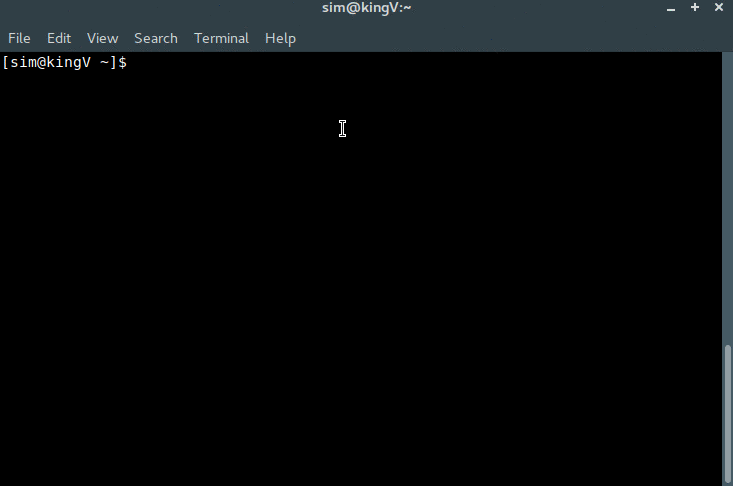

# Scrybe
Scrybe is a simple terminal application for taking notes, using your favourite terminal editor, and storing them in an sqlite database. Notes consist of a title, a body and a set of comma separated tags that can be used to sort them however you like. Scrybe includes a search function at the minute, and a filtering function to allow you to view all the notes of a certain tag will be added when I get around to it.

### Contribution

Don't like something, or want something? Add an issue, submit a pull request or fork the repo :). There is a todo file, but I won't promise to keep it exceptionally up to date.

### Python Version Notes
Scrybe is written in python 2, mainly because my muscle memory has mapped "run 
this python file" to typing "python blah". There is a python3 branch, which
will be updated sporadically with whatever features have been added since its
last updated, but it won't be kept in lock step with the master branch.

As a result of this, if your terminal has `python` aliased to python3 instead of
python2, you'll have to either change that or modify the alias put in your 
~/.bashrc (or your shell equivalent). Sorry.

## Setup:

```bash
git clone https://github.com/oliverb123/scrybe scrybe/
# Clone the repository
cd scrybe/
# Change directory into scrybe/
python setup.py
# Run the setup python script
```
After that, you have to chose your preferred editor,
`vim, emacs, or nano?: vim`

That's it, `scrybe` will now be an alias in your .bashrc, or the current shell you are using.
Now you're off to the races!  

## Usage

The general structure of commands for scrybe are as follows:

command;parameter 1;parameter 2 etc.

The help command ("h/H") provides a useful way to review the commands available
to you within scrybe, but it uses some specific notation to tell you whether
and option must be included or not. Things that are simply written, with no 
punctuation around them, e.g. "note-id", are mandatory for that command. Things
surrounded by square brackets, e.g. "[tags - comma-separated]" are optional 
parameters for this command, and things surrounded by standard brackets, e.g.
"[b(oth)]" are there to provide some explanation, usually for a single letter
parameter. When parameters are separated by a comma, it means you must choose one
from the list shown.

#### Command reference:

* h/H : Displays the help message, which is a less verbose version of this
reference

* l/L;[c(urrent - default option), a(rchived), b(oth)] : List every note you
have saved to scybe, defaulting to notes you haven't archived yet. Note that the
implementation of archiving notes is spotty at best, right now I'd simply ignore
it -- It's on the todo list

* t/T : List every tag you've applied to any note in scrybe

* s/S;search-string;[c(urrent - default), a(rchived), b(oth)] : performs a
weighted search of your notes, and prints a list of matching notes, ordered by
how well they match your search term. The weighting of the search is still
changing, so if you have a suggestion feel free to open an issue!

* f/F;filter;archive-mode;filter-mode - Filter. The filter has two main modes, tag based filtering and create time based filtering. The paramters passed to each filter mode are as follows:
    * Tag based filter - signature: f/F;tag1,tag1,...,tagN;[c(urrent - default), a(rchived), b(oth)];[t] - notes will only pass through a tag based filter if **all tags** in the filter are attached to the note. Tag based filtering is the default filter mode, and it will only look at non-archived notes by default
    * Date based filter - signature: f/F;filter;[c(urrent - default), a(rchived), b(oth)];d - the filter options for date filtering are as follows:
        * You can pass a keyword to the filter to get every note created in the last whatever the keyword is. Supported keywords right now are "day", "week", "month", "quarter" and "year"
        * You can also pass a single date in the form dd/mm/yyyy to get every note created since that date e.g. f;01/09/2017;b;d will get every note, archived or not, created since the first of september 2017. f;01/09/2017;;d would get only the unarchived ones
        * You can also pass two dates in the format dd/mm/yyyy:dd/mm/yyyy to get every note created between those two dates, e.g. f;01/01/2017:01;02;2017;b;d will get every note created between the first of January 2017 and the first of february 2017. **Please note** this will exclude notes created **on** the first of February 2017.

* a/A;title;[tags - comma seperated] : Add a new note - pretty self explanatory

* arch;note-id;[in(default), out] : Move a note into or out of the archive.

* d/D;note-id : Delete a note from scrybe, forever. You'll be asked to confirm
before the note is deleted, so don't panic too much if you accidentally miss 
type

* e/E;note-id;[title];[tags - comma seperated list] : edit a note. If title is left blank, it's kept unchanged. If tags are left blank, they're kept unchanged. If you don't modify the note body when the editor launches before saving and quitting, or if you totally clear the editor (save a blank file), the body will be left unchanged. If you preface the comma separated tag list with a "+", the tags will be added to the already existing tags, otherwise they will overwrite the already existing tags.

* g/G : Print the entire text of a note, as well as all it's metadata (title,
tags, createTime and whether or not it's archived)

* c/C : clear the terminal screen, for people like me who live a clear terminal

* q/Q : close scrybe

# License

Scrybe is licensed under the MIT license. See the LICENSE file for more information.

# Enjoy!!
